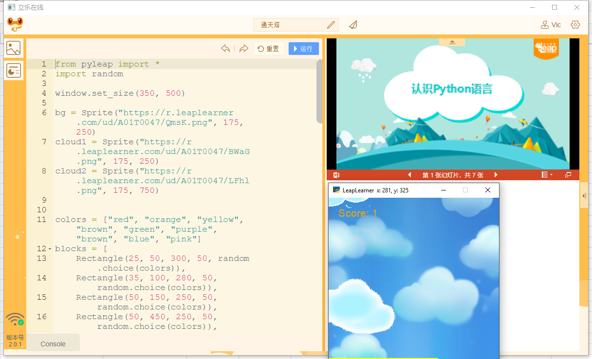

## pyleap简介

pyleap是由LeapLeaner开发的基于python的一个插件，有了pyleap，我们就可以在浏览器上使用简单的一些命令进行动画的创作，开发各种小游戏等。利用pyleap学习python，可以让你在学习python的过程中充满乐趣。

### 编写和运行环境

要尝试pyleap，只要打开运行环境：http://code.leaplearner.com，切换到python模式，在左侧输入代码，点击运行，就可以看到效果了！在第一次打开这个页面时，我们已经为你创建了默认的代码，你可以尝试着去修改代码中的数字，来看看每个数字代表什么含义。



### pyleap运行环境

#### 安装pyleap

首先，确保你已经安装了python3.x版本，然后使用命令行安装pyleap模块以及网页pyleap运行环境的，命令为

```shell
pip install pyleap
```

安装过程中会前置库pyglet、leapserver。

#### 使用pyleap

在代码中引入pyleap即可使用pyleap所带的功能

```python
from pyleap import *
```

#### 配合code.leaplearner.com使用

在开始之前，在命令行中输入以下命令开启立乐python服务，允许我们在网页环境中使用我们的python。每次在立乐编辑环境中使用时，都要提前开启leapserver服务。

```shell
python -m leapserver
```


<div class="admonition hint ">
<p class="first admonition-title">小提示</p>
<p class="last">这是一个在线的python编辑环境，所有的python代码都将保存在云端。</p>
</div>
