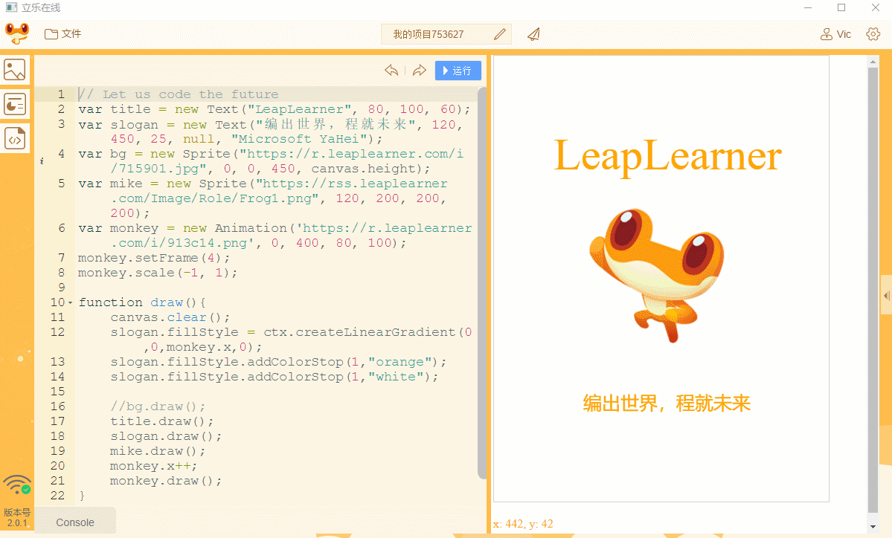
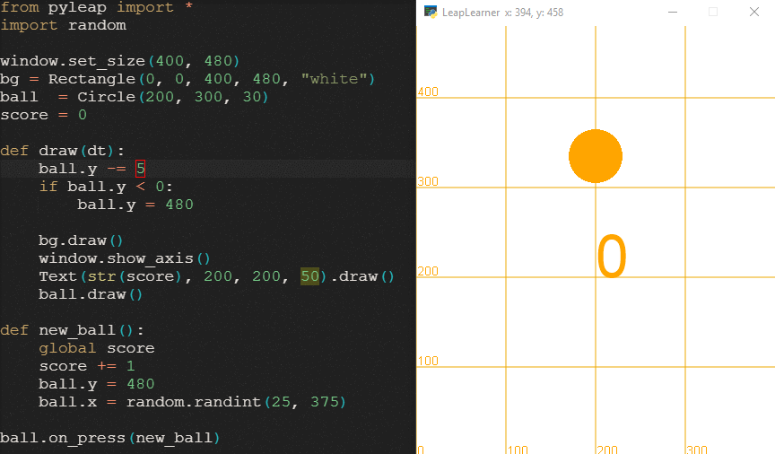
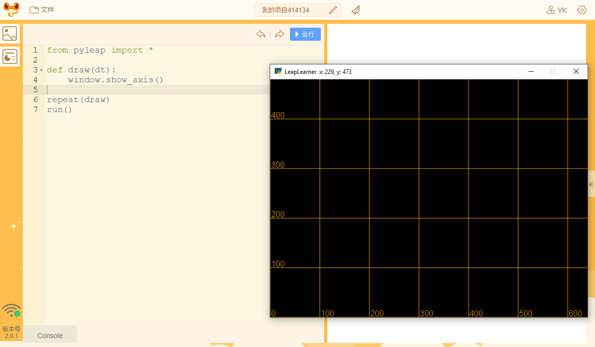
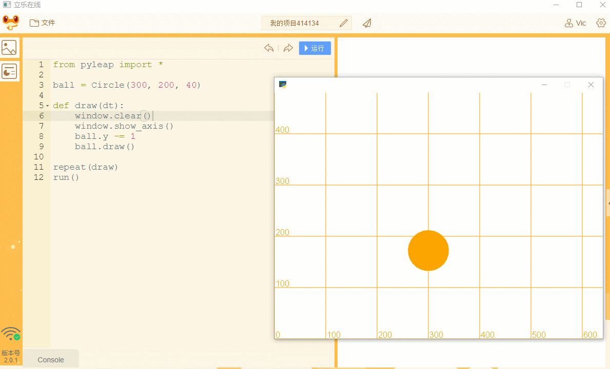

## 第一个小程序

让我们开始开发我们的第一个小程序，一个接球的小游戏。在开发这个小游戏时，你可能对其中很多概念都不懂，不要担心，按照提示步骤一步步去做，你会发现这一切是多么的简单！

如果还没有安装运行环境，请点击以下软件进行安装

### 使用立乐在线

下载地址： [windows](https://rss.leaplearner.com/assets/leaponline/win32/立乐在线 Setup 0.1.0.exe) [mac](https://rss.leaplearner.com/assets/leaponline/win32/立乐在线-0.1.0.dmg)

下载安装后，要尝试pyleap，只要打开软件，切换到python模式，点击运行，就可以看到效果了！在第一次打开这个页面时，我们已经为你创建了默认的代码，你可以尝试着去修改代码中的数字，来看看每个数字代表什么含义。



### 目标：从零开始制作一个接球小游戏

游戏规则很简单，让小球从上方掉落，每次点中小球，分数加1，同时让小球重新从上方随机掉落，随着分数的提高，小球的下落速度也会越来越快，看看你最高能拿到多少分数！



#### 了解我们的窗口

新建一个python项目，修改项目默认代码，在`draw(dt)`(第4行)函数下添加以下代码，然后点击运行按钮，顺利的话，你就成功创建了一个窗口程序，可以看到在画布上显示出了坐标。

```python
from pyleap import * 

def draw(dt):
    window.show_axis()

repeat(draw)
run()
```

<div class="admonition error ">
	<p class="first admonition-title">代码书写注意事项</p>


<p>在Python中，缩进是非常重要的，一般是4个空格，任何缩进上的错误都将导致代码无法运行</p>

<p>单词必须拼写正确，不能多一个字母，也不能少一个字母，最重要的是，字母的大小写不能写错。</p>

<p class="last">必须是英文符号，特别是点`.`和括号`()`，计算机只能识别英文符号，而不能识别中文符号。</p>

</div>



图中的坐标系也称之为笛卡尔坐标系，在数学中被广泛运用，坐标左下角是原点，往右是x轴正方向，往上是y轴正方向。窗口中的点都和坐标一一对应，由此，我们可以使用数字来确定窗口中任意图形的位置。

#### 我们创建一个小球出来

创建一个小球，名字为`ball`，小球的中心坐标点为`(300, 200)`，大小为`25`，在pyleap中，圆对象叫做`Circle`，我们一般用首字母大写来表示一类对象。定义圆的x坐标为300，y坐标为200，半径r为25。

```python
ball = Circle(x=300, y=200, r=25)
```

如果我们按照x、y、r的顺序来表示Circle的参数，那么就可以省略掉参数的标注，可以直接写成下述方式。

```python
ball = Circle(300, 200, 25)
```

在第3行，我们创建了一个ball对象，代表了右侧的这个小球。

第7行，在`draw`函数中，我们使用小球的`draw`方法，将这个小球画在了画布上。同样注意这里的括号和空格，以免出现语法错误。


#### 让小球动起来

为了让小球动起来，我们需要重复做这么一个操作：

1. 把画布清空
2. 把小球往下移动一段距离
3. 把小球画在画布上
4. 每隔一段时间执行以上1-3步代码

当我们非常快的完成1-3步时，同时不停的重复以上步骤，我们就能感觉小球在画布上动起来了！当然，我们需要让计算机帮我们做这么一件事情。


定义一个函数，执行以上1-3步骤功能，每次执行这个函数，就会执行1-3步。

```python
def draw(dt):
    window.clear()
    ball.y -= 1
    ball.draw()
```

最后用`repeat`方法，每隔一段时间执行这个函数。

```python
repeat(draw);
```

我们可以看到，小球动起来了，但是画布的坐标也不见了。这是因为我们在清理完画布之后，没有再把坐标画出来。那么，在清理画布后，重新将坐标显示出来就可以了。那么，到这一步，代码就变为下面的代码。我们不再需要第一行的`window.showAxis()`，因为我们已经在后续的步骤中重复执行这个函数了。

```python
from pyleap import *

ball = Circle(300, 200, 25);

def draw():
    windows.clear()
    windows.showAxis()
    ball.y -= 1
    ball.draw()

repeat(draw)
```



#### 点击小球让小球回到上方

完成小球的移动后，小球会一直往下移动，最终离开画布，重新运行才能再次看到小球。我们希望点击小球的时候能让小球回到上方。为此，我们为小球的点击添加一个函数，这个函数的功能是，让小球的y位置回到100。在代码的最后添加几个新的代码行，并将下面的代码写进去。

```python
def back_to_top():
    ball.y = 480
```

在这个函数的基础上，添加一个事件，当小球被点击的时候触发

```python
@ball.on_press
def back_to_top():
    ball.y = 480
```

再次运行，点击小球，小球就可以回到100的位置了。接着，为这个函数添加第二个功能，让小球的x位置随机出现在0到640的位置。

添加randint方法，randint用于产生一个随机数，比如randint(0, 100)会产生一个0到100的随机整数

```python
from random import randint
```

最终完整的代码应该像下面这样，注意前后顺序不能错误。

```python
from pyleap import * 
from random import randint

ball = Circle(300, 200, 40)

def draw(dt):
    window.clear()
    window.show_axis()
    ball.y -= 1
    ball.draw()

@ball.on_press
def return_to_top():
    ball.x = randint(0, 640)
    ball.y = 480
    
repeat(draw)
run()
```

<div class="admonition tip ">
<p class="first admonition-title">修改原来的函数</p>

<p>在原来的函数基础上，添加新的代码，无需重复写这些代码哦</p>

</div>

最终，完整的代码和运行效果应该如下图所示，快看你的作品是不是完成了呢？


#### 改变小球掉落的速度

最后一步，为我们的游戏添加挑战。按照以下步骤，参照最终代码，相信你一定可以完成的！

1. 添加一个属性`ball.spee`用来记录小球的速度，默认为1分`ball.speed = 1`
2. 每次成功点击时，增加1分，`ball.speed += 1`
3. 同时，修改`ball.y -= 1`为`ball.y -= ball.speed`，让小球随着速度变化而移动
4. 最后，将速度显示在窗口中，`Text(str(ball.speed), 150, 150, 30).draw()`

```python
from pyleap import * 
from random import randint

ball = Circle(300, 200, 40)
ball.speed = 1

def draw(dt):
    window.clear()
    window.show_axis()
    ball.y -= ball.speed
    ball.draw()
    Text(str(ball.speed), 10, 430, 30).draw()

@ball.on_press
def return_to_top():
    ball.x = randint(0, 640)
    ball.y = 480
    ball.speed += 1
    
repeat(draw)
run()
```

至此，一个完整的游戏就制作完成了，你觉得还有什么地方可以改进的呢？

