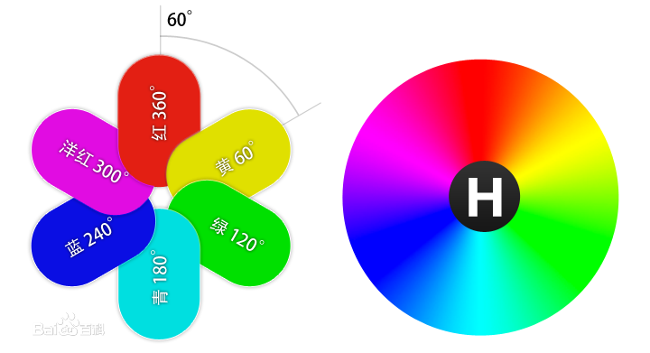
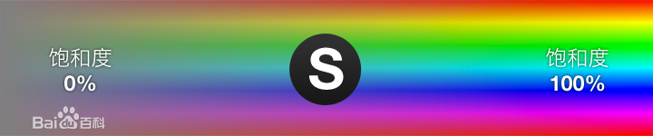
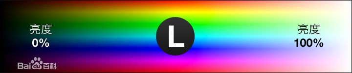

# hsl颜色表示法

HSL色彩模式是工业界的一种颜色标准，是通过对色相(H)、饱和度(S)、明度(L)三个颜色通道的变化以及它们相互之间的叠加来得到各式各样的颜色的，HSL即是代表色相，饱和度，明度三个通道的颜色，这个标准几乎包括了人类视力所能感知的所有颜色，是迄今运用最广的颜色系统之一。

hsl颜色表示法是一个更适合人类理解的颜色表示法

## 模型原理

H： Hue 色相
S：Saturation 饱和度
L ：Lightness 明度
HSL色彩模式使用HSL模型为图像中每一个像素的HSL分量分配一个0~255范围内的强度值。HSL图像只使用三种通道，就可以使它们按照不同的比例混合，在屏幕上重现16777216种颜色。
在 HSL 模式下，每种 HSL 成分都可使用从 0到 255的值。（其中L是从黑（0）到白（255）渐变）

## 色相 Hue

HSL的H(hue)分量，代表的是人眼所能感知的颜色范围，这些颜色分布在一个平面的色相环上，取值范围是0°到360°的圆心角，每个角度可以代表一种颜色。色相值的意义在于，我们可以在不改变光感的情况下，通过旋转色相环来改变颜色。在实际应用中，我们需要记住色相环上的六大主色，用作基本参照：360°/0°红、60°黄、120°绿、180°青、240°蓝、300°洋红，它们在色相环上按照60°圆心角的间隔排列。

## 饱和度 Saturation

HSL的S(saturation)分量，指的是色彩的饱和度，它用0%至100%的值描述了相同色相、明度下色彩纯度的变化。数值越大，颜色中的灰色越少，颜色越鲜艳，呈现一种从理性(灰度)到感性(纯色)的变化。

## 亮度：Lightness

HSL的L(lightness)分量，指的是色彩的明度，作用是控制色彩的明暗变化。它同样使用了0%至100%的取值范围。数值越小，色彩越暗，越接近于黑色；数值越大，色彩越亮，越接近于白色。

