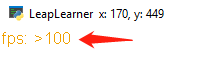

# 窗口 window

pyleap中已经帮你创建了一个`window`对象，代表了运行的这个窗口。


## 属性速查 Attributes

| 属性     | 说明                    |
| -------- | ----------------------- |
| caption  | 窗口标题，只读          |
| width/w  | [窗口宽度，只读](#宽度) |
| height/h | 窗口高度，只读          |

## 方法速查 Methods

| 方法                             | 说明                                 |
| -------------------------------- | ------------------------------------ |
| window.clear()                   | 清楚窗口内容                         |
| window.set_caption(caption)      | 设置标题，参数：字符串               |
| window.set_size(w, h)            | 设置窗口宽度和高度，参数：正整数     |
| window.show_axis()               | 在窗口中显示坐标系                   |
| window.show_fps()                | 在窗口中显示帧数                     |
| window.keep_on_top() (仅windows) | 让窗口保持在最前面，务必查看使用说明 |

## 窗口的属性 window attributes

### 宽度和高度 window.w, window.h

设置窗口宽度和高度
举例：

```python
window.set_size(400, 500)
```

## 帧数展示 window.show_fps()



以文本的形式在屏幕左上角显示当前的fps（Frame per Second），每秒刷新速率。FPS和电脑的性能及程序的计算量相关，当FPS下降到20以下时，就可以明显感觉到卡顿现象。

大量的图片绘制会增加运行时的计算量，因此在使用大量图片时，考虑使用batch功能。另外，优化程序结构和逻辑也会相应的降低运行计算量。

`window.show_fps()`只是一个普通的显示
示例代码

```python
from pyleap import *

@repeat
def draw(dt):
    window.clear()
    Text("LeapLearner", 120, 100, 50).draw()
    window.show_fps()

run()
```

## 保持窗口在最前面 window.keep_on_top()

窗口保持在最前面需要操作系统的支持，对windows来说，需要安装win32模块允许python操作操作系统。第一次使用时，在立乐在线中输入`pywin32`进行安装，文件较大，需要花费较长的时间。如果通过模块来安装，使用以下命令

```shell
pip install pywin32
```

keep_on_top()只要调用一次，就可以设置成功，无需循环调用。

示例代码

```python
from pyleap import *

window.keep_on_top()

@repeat
def draw(dt):
    window.clear()
    Text("LeapLearner", 120, 100, 50).draw()
    window.show_fps()

run()
```

重要的问题：
当你在使用zoom进行屏幕共享的时候，keep_on_top()方法会和zoom的屏幕共享功能发生冲突
